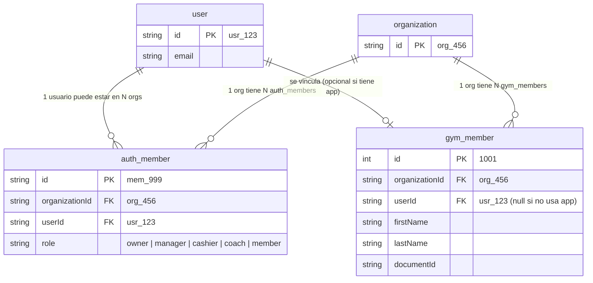

nece# Fit-Stack: Arquitectura del Sistema y Decisiones de Diseño

Este documento consolida la arquitectura del sistema, el modelo de datos, los patrones de diseño y las decisiones técnicas fundamentales de **Fit-Stack**.

---

## 1. Visión General del Producto

Fit-Stack es una plataforma **SaaS Multi-tenant B2B** diseñada para la gestión de gimnasios y centros deportivos en Latinoamérica. Resuelve tres problemas críticos del sector:
1. **Facturación Multi-moneda y Retención**: Gestión de membresías con precios base en USD y cobro en divisas locales según tasas de cambio dinámicas.
2. **Expiración Acumulativa de Subscripciones**: Al renovar una membresía activa, los nuevos días se agregan al `endDate` actual (no a la fecha de hoy), garantizando que el usuario no pierda días pagados.
3. **Control Físico de Acceso Automatizado**: Integración mediante hardware/biometría en el ingreso del gimnasio sincronizado con el estado de cobranza en la nube.

---

## 2. Visión General de la Arquitectura (Monorepo)

El proyecto utiliza un monorepositorio gestionado por **Turborepo** y **pnpm**.

```
fit-stack/
├── apps/
│   ├── api-worker/       # [ACTIVA] Backend API principal (Hono + Cloudflare Workers)
│   ├── jobs-worker/      # Consumidor de Cloudflare Queues (Emails via Resend, PDFs, Notificaciones)
│   ├── panel/            # Next.js 16 - Panel de administración para gimnasios (Staff/Owners/Cashiers)
│   ├── web/              # Next.js 16 - Portal público y app web de socios/miembros
│   ├── console/          # Next.js 16 - Panel interno Super-Admin de la Plataforma SaaS
│   ├── bridge/           # Python / Flet - App Desktop local para torniquetes y biometría
│   └── api/              # [DEPRECATED] Backend Next.js legado (Sustituido por api-worker)
└── packages/
    ├── database/         # Drizzle ORM + cliente Neon Postgres Serverless
    ├── shared/           # Constantes, DTOs, Permisos (RBAC) y helpers compartidos
    ├── auth/             # Cliente isomórfico de Better Auth & React Hooks
    ├── ui/               # Componentes UI (shadcn/ui v4 + Tailwind CSS)
    ├── eslint-config/    # Reglas de Linter del monorepo
    └── typescript-config/ # Configuraciones base de TypeScript
```

---

## 3. Decisiones Arquitectónicas del Backend (`apps/api-worker`)

### 3.1. Migración a Cloudflare Workers (`api-worker`)
* **Decisión**: La API principal reside en `apps/api-worker` construida con **Hono** y desplegada en **Cloudflare Workers**. La API antigua en Next.js (`apps/api`) ha sido declarada **DEPRECATED**.
* **Razones**:
  * **Latencia Ultra Baja (Edge)**: Ejecución en aislados V8 globales sin arranque en frío (*cold starts*).
  * **Eficiencia Económica**: Modelo de costos optimizado con tiempo de ejecución efímero.
  * **Ecosistema Integrado**: Conexión nativa con **Cloudflare Queues** (`jobs-worker`) y **Cloudflare R2** para almacenamiento de imágenes/documentos.

### 3.2. Patrón de Capas y Composición (`Route → Service → Repository → Database`)

Para mantener el código testeable, desacoplado y libre de side-effects en los aislados V8 de Workers, se exige un patrón de capas estricto mediante **Inyección de Dependencias por Parámetro (Factory Functions)**:

```
[HTTP Request] ──> [Hono Middleware (createDb)] ──> [Route Handler] 
                                                        │
                                                        ▼
[Database (Neon HTTP)] <── [Repository Factory] <── [Service Factory]
```

#### A. DB Factory por Request (`@workspace/database/factory`)
En Cloudflare Workers las variables de entorno (`c.env.DATABASE_URL`) no existen globalmente (`process.env` no existe). Por ende, el cliente de base de datos **se instancia por cada HTTP request** a través del driver HTTP de Neon (`@neondatabase/serverless` + `drizzle-orm/neon-http`):

```ts
// En apps/api-worker/src/index.ts (Middleware Global)
app.use('*', async (c, next) => {
  const db = createDb(c.env.DATABASE_URL);
  c.set('db', db); // Inyectado en el contexto de Hono
  await next();
});
```

#### B. Repositorios (`createXRepository(db: Db)`)
Reciben la instancia `db` por parámetro. Devuelven métodos de consulta/mutación con **aislamiento multi-tenant estricto** (`WHERE organizationId = ?`):

```ts
export function createPaymentsRepository(db: Db) {
  return {
    async findBySubscriptionId(organizationId: string, subscriptionId: number) {
      const [record] = await db
        .select()
        .from(payment)
        .where(
          and(
            eq(payment.subscriptionId, subscriptionId),
            eq(payment.organizationId, organizationId)
          )
        );
      return record;
    },
  };
}
export type PaymentsRepository = ReturnType<typeof createPaymentsRepository>;
```

#### C. Servicios (`createXService(repository)`)
Contienen la lógica de negocio pura, validaciones y orquestación de repositorios:

```ts
export function createPaymentsService(paymentsRepo: PaymentsRepository) {
  return {
    async getPaymentDetails(organizationId: string, id: number) {
      const payment = await paymentsRepo.findById(organizationId, id);
      if (!payment) throw new Error("Pago no encontrado");
      return payment;
    },
  };
}
```

#### D. Rutas (`Hono Route Handlers`)
Ensamblan la cadena de dependencias a partir del contexto `c.get('db')` y ejecutan los middlewares de permisos:

```ts
app.get('/:id', requireOrgPermission(PM.SUBSCRIPTIONS, PA.READ), async (c) => {
  const orgId = c.get('session')!.activeOrganizationId!;
  const repo = createPaymentsRepository(c.get('db'));
  const service = createPaymentsService(repo);

  const result = await service.getPaymentDetails(orgId, Number(c.req.param('id')));
  return c.json(result);
});
```

---

## 4. Base de Datos y Drizzle ORM

### 4.1. Regla de Oro: Cero `pgEnum` en el Esquema
* **Regla**: **Está prohibido utilizar `pgEnum` de PostgreSQL en `packages/database/src/schema.ts`**.
* **Motivo**: Los tipos enum de PostgreSQL (`CREATE TYPE ... AS ENUM`) impiden modificar o eliminar valores dentro de transacciones de migración estándar en Postgres, lo que rompe de forma recurrente las migraciones automáticas de Drizzle (`pnpm db:generate` / `pnpm db:migrate`).
* **Estándar Aprobado**: Usar columnas de tipo `text('columna').$type<UnionType>()`:
  ```ts
  // Correcto: Cero fallos en migraciones + 100% Tipado Estricto en TypeScript
  export const memberPayment = pgTable('payment', {
    status: text('status')
      .$type<'processing' | 'validated' | 'invalid' | 'voided'>()
      .default('validated')
      .notNull(),
  });
  ```

### 4.2. Modelo Unificado de Usuarios (Diagrama ER)

El sistema separa claramente la **identidad global de autenticación** del **perfil local del cliente dentro del gimnasio**:



* **`user`**: Identidad global de usuario en Better Auth.
* **`auth_member` (`member`)**: Membresía de la organización en Better Auth (asigna roles `owner`, `manager`, `cashier`, `coach`, `member`).
* **`gym_member`**: Perfil físico del cliente en el gimnasio (`userId` es nullable para permitir clientes locales sin app móvil).

---

## 5. Control de Acceso y Permisos (RBAC)

### 5.1. Fuente Única de Verdad: `@workspace/shared`
Toda la matriz de autorización está centralizada en `packages/shared/src/access-control.ts`.

Existen dos niveles de acceso:
1. **Plataforma Staff (`platformAc`)**: Roles globales para la gestión del SaaS (`owner`, `admin`, `support`).
2. **Organizaciones Gym (`organizationAc`)**: Roles de tenant (`owner`, `manager`, `cashier`, `coach`, `member`).

### 5.2. Permiso `panel: ["access"]` y Nomenclatura `hasAccess`
* Se definió la acción `panel: ["access"]` en el `organizationStatement` para controlar dinámicamente el ingreso a la aplicación `apps/panel`.
* **Nomenclatura Profesional**: En las vistas y componentes del cliente, el chequeo se realiza mediante la función `hasAccess`:
  ```tsx
  import { usePermissions } from '@workspace/auth/hooks';
  import { PERMISSION_MODULES, PERMISSION_ACTIONS } from '@workspace/shared';

  const { hasAccess } = usePermissions();

  if (hasAccess(PERMISSION_MODULES.PANEL, PERMISSION_ACTIONS.ACCESS)) {
    // Renderiza la navegación del panel
  }
  ```
* **Uso de Constantes**: Se prohíbe escribir *magic strings* arbitrarias. Todas las consultas de permisos consumen `PERMISSION_MODULES` y `PERMISSION_ACTIONS`.

### 5.3. Autorización de Subida de Archivos (Upload Bypass)

La ruta `POST /api/upload/presigned` aplica una lógica de autorización dual:

```ts
const platformRole = (user as any)?.role;
const isPlatformUser = platformRole && ['owner', 'admin', 'support'].includes(platformRole);
const isOrgUser = Boolean((session as any).member && authorizeUpload(session, orgId));

if (!isPlatformUser && !isOrgUser) {
  return c.json({ error: 'Forbidden' }, 403);
}
```

**Regla**:
- **Usuarios de plataforma** (`admin`, `owner`, `support` global roles) pueden subir archivos a **cualquier organización** sin requerir membresía orgánica.
- **Usuarios de organización** deben tener membresía en la org destino **y** pasar `authorizeUpload` (permiso `MEMBERS.CREATE` o `CONTENT.CREATE`).
- Esto permite que super-admins suban logos, imágenes CMS, etc., a organizaciones sin necesidad de ser agregados como miembros de cada una.

---

## 6. Rendimiento y Caché (Upstash Redis)

* `apps/api-worker` utiliza **Upstash Redis** (`@upstash/redis`) para caché de alto rendimiento con tiempo de respuesta < 10ms.
* **Patrones de Llaves**:
  * `org:${orgId}:settings` (TTL: 10 min)
  * `org:${orgId}:classes:*` (TTL: 5 min)
  * `org:${orgId}:cms:pages*` (TTL: 5 min)
  * `member:role:${userId}:${orgId}` (TTL: 1 min)
* **Invalidación Proactiva**: En cada operación mutativa (`POST`, `PUT`, `DELETE`), las rutas invalidan automáticamente los patrones de caché correspondientes.

---

## 7. Integración de Hardware (`apps/bridge`)

La aplicación desktop en Python/Flet corre en la PC de recepción del gimnasio.
* **Autenticación**: Cabecera `x-api-key`.
* **Flujo**: Consulta `POST /api/access-control/verify` para validar el documento biométrico o código QR del socio. Si el miembro tiene una suscripción activa, la API responde con éxito y abre el torniquete, registrando la entrada en `access_control_log`.
