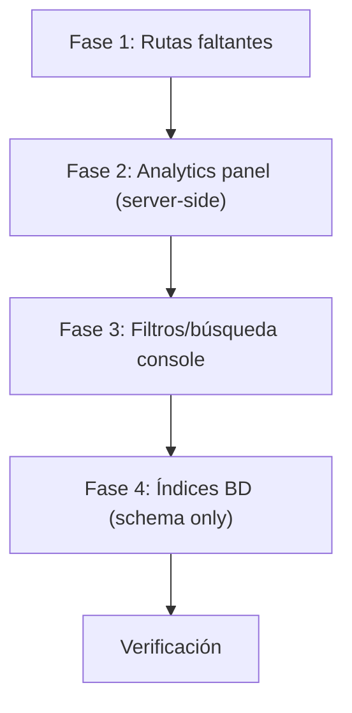

# Corrección de bugs críticos en flujo de suscripciones

El análisis fue validado contra el código fuente. Se confirman **2 rutas faltantes** (404 reales), **filtros/búsqueda rotos** en console, **analítica muerta** en panel, y **falta total de índices** en tablas de pagos/suscripciones. La arquitectura base está bien (estado computado SQL, snapshots, caché, Zod, permisos).

## Decisiones de alcance

| Categoría | Acción | Justificación |
|-----------|--------|---------------|
| 🔴 Rutas faltantes (PUT sub, PATCH payment status) | **Corregir** | Acciones de UI que dan 404, afectan operación diaria |
| 🔴 Analítica de pagos no carga en panel | **Corregir** | KPIs/gráfico invisibles hasta primera mutación |
| 🟠 Filtro status post-LIMIT en console | **Corregir** | Paginación rota, devuelve 0 filas con filtro |
| 🟠 Búsqueda muerta en console | **Corregir** | Input decorativo, no filtra nada |
| 🟠 Filtros "Por Vencer"/"Vencidas" | **Corregir** | Chips que no filtran nada real |
| 🟡 Índices de BD | **Corregir** | Cuello de botella real con subqueries correlacionadas |
| 🟡 Atomicidad de escrituras | **Diferir** | Serverless HTTP (no TCP) — `db.transaction` no aplica |
| 🟡 Race condition en pagos | **Diferir** | Requiere índice parcial único + refactor mayor, riesgo bajo en práctica |
| 🟡 Duplicación subqueries | **Diferir** | Optimización menor, los índices resuelven el 90% del problema |
| 🔴 "Registrar Pago" en console muerto | **Diferir** | Requiere diseño de UI/UX nuevo (modal/form), escapa alcance de bugfix |
| 🟡 changePlan ruta muerta | **Diferir** | Feature incompleto desde legacy, requiere diseño de negocio |
| 🟡 updatePeriodEnd sin concurrencia | **Diferir** | Requiere optimistic locking, baja probabilidad de colisión |

---

## Propuesta de cambios

### Fase 1 — Rutas faltantes (🔴 Crítico)

---

#### [MODIFY] [subscriptions.ts](file:///c:/Users/LAPTOP/Documents/PROJECTS/fit-stack/apps/api-worker/src/routes/subscriptions.ts)

Agregar ruta `PUT /:id` para actualizar el status de una suscripción (revoke/restore):

```ts
// PUT /:id — Update subscription status (revoke/restore access)
subscriptionsRouter.put(
  "/:id",
  requireOrgPermission(PM.SUBSCRIPTIONS, PA.UPDATE),
  zValidator("json", updateSubscriptionStatusSchema),
  async (c) => {
    const { id } = c.req.param()
    const { status } = c.req.valid("json")
    const orgId = c.get("session")!.session.activeOrganizationId!
    const db = createDb(c.env.DATABASE_URL)
    const repo = createSubscriptionsRepository(db)
    const service = createSubscriptionsService(repo, createCache(c.env))
    const result = await service.updateStatus(id, status, orgId)
    return c.json(result)
  }
)
```

#### [MODIFY] [subscriptions.service.ts](file:///c:/Users/LAPTOP/Documents/PROJECTS/fit-stack/apps/api-worker/src/services/subscriptions.service.ts)

Agregar método `updateStatus` al servicio. La revocación se implementa seteando `cancelledAt` (el status se computa en SQL via CASE). Restaurar limpia `cancelledAt`:

```ts
updateStatus: async (id: number, status: string, organizationId: string) => {
  const result = await repo.updateStatus(id, status, organizationId)
  await cache?.invalidate(`org:${organizationId}:subscriptions`)
  return result
}
```

#### [MODIFY] [subscriptions.repository.ts](file:///c:/Users/LAPTOP/Documents/PROJECTS/fit-stack/apps/api-worker/src/repositories/subscriptions.repository.ts)

Agregar método `updateStatus` al repositorio. Usa `cancelledAt` para revocación (no hay columna `status` en la tabla gym `subscription`):

```ts
updateStatus: async (id: number, status: string, organizationId: string) => {
  // "cancelled" → set cancelledAt, "active" → clear cancelledAt
  const [result] = await db.update(subscription)
    .set({ 
      cancelledAt: status === 'cancelled' ? new Date() : null,
    })
    .where(and(
      eq(subscription.id, id),
      eq(subscription.organizationId, organizationId)
    ))
    .returning()
  if (!result) throw new Error("Subscription not found")
  return result
}
```

> Schema de validación: se creará `updateSubscriptionStatusSchema` con zod (validando `status` como union `"active" | "cancelled"`).

---

#### [MODIFY] [platform/subscriptions.ts](file:///c:/Users/LAPTOP/Documents/PROJECTS/fit-stack/apps/api-worker/src/routes/platform/subscriptions.ts)

Agregar ruta `PATCH /payments/:paymentId/status`:

```ts
// PATCH /payments/:paymentId/status — Update payment status
platformSubscriptionsRouter.patch(
  "/payments/:paymentId/status",
  requirePlatformAuth(),
  zValidator("json", updatePaymentStatusSchema),
  async (c) => {
    const { paymentId } = c.req.param()
    const { status } = c.req.valid("json")
    const db = createDb(c.env.DATABASE_URL)
    const repo = createPlatformSubscriptionsRepository(db)
    const service = createPlatformSubscriptionsService(repo, createCache(c.env))
    const result = await service.updatePaymentStatus(paymentId, status)
    return c.json(result)
  }
)
```

> [!IMPORTANT]
> Esta ruta debe montarse **antes** de `/:id/payments` para que Hono no la interprete como un `:id` dinámico. Verificaré el orden al implementar.

---

### Fase 2 — Analítica de pagos en panel (🔴 Crítico)

Solución server-side: mover el fetch de analytics al RSC (`page.tsx`) para que llegue con datos reales al cliente.

---

#### [MODIFY] [page.tsx](file:///c:/Users/LAPTOP/Documents/PROJECTS/fit-stack/apps/panel/app/dashboard/payments/page.tsx)

Reemplazar `initialAnalytics={null}` por un fetch real usando `financeService.getAnalytics(primaryCurrency)`:

```ts
const [subsResult, monthlyReport, analytics] = await Promise.all([
  subscriptionsService.getAll(
    { page, limit: PAGE_LIMIT, query: search || undefined, status: statusFilter || undefined },
    { next: { revalidate: 60, tags: [subsTag] } },
  ),
  financeService.getRevenueReport(primaryCurrency).catch(() => []),
  financeService.getAnalytics(primaryCurrency).catch(() => null),  // NEW
]);

// ...
<PaymentsClient
  initialAnalytics={analytics}   // was: null
  // ... rest of props unchanged
/>
```

Esto sigue el patrón RSC del proyecto (Server First). El componente cliente ya maneja `initialAnalytics` correctamente cuando no es `null`.

---

### Fase 3 — Filtros y búsqueda en console (🟠)

---

#### [MODIFY] [platform/subscriptions.repository.ts](file:///c:/Users/LAPTOP/Documents/PROJECTS/fit-stack/apps/api-worker/src/repositories/platform/subscriptions.repository.ts)

Refactorizar `findAll` para mover el filtro de status y búsqueda a SQL:

1. **Filtro de status en SQL**: Usar el CASE expression de `getSubscriptionStatusSql()` como subexpresión en un `WHERE` o wrapping con CTE/subquery, para que el filtrado ocurra **antes** del `LIMIT`.

2. **Búsqueda**: Agregar `ilike` sobre nombre de organización y nombre de plan.

3. **Total count con filtro**: El `count(*)` debe reflejar las mismas condiciones de filtrado.

Estrategia: usar una CTE (`WITH`) que compute el status, y luego filtrar/paginar sobre ella:

```ts
findAll: async ({ page, limit, status, search }: FindAllParams) => {
  const offset = (page - 1) * limit
  
  // Build WHERE conditions
  const conditions = []
  
  if (status) {
    // Apply computed status filter in SQL via HAVING or wrapping
    conditions.push(sql`(${getSubscriptionStatusSql()}) = ${status}`)
  }
  
  if (search) {
    conditions.push(
      or(
        ilike(organization.name, `%${search}%`),
        ilike(platformPlan.name, `%${search}%`)
      )
    )
  }
  
  const whereClause = conditions.length > 0 
    ? and(...conditions) 
    : undefined

  const data = await db.select({
    // ... all existing fields
    computedStatus: getSubscriptionStatusSql(),
    latestPaymentStatus: getLatestPaymentStatusSql(),
    paymentsCount: getPaymentsCountSql(),
  })
  .from(platformSubscription)
  .leftJoin(platformPlan, eq(platformSubscription.planId, platformPlan.id))
  .leftJoin(organization, eq(platformSubscription.organizationId, organization.id))
  .where(whereClause)
  .orderBy(desc(platformSubscription.createdAt))
  .limit(limit)
  .offset(offset)
  
  // Count with same filter conditions
  const [{ count: total }] = await db.select({ count: sql<number>`count(*)` })
    .from(platformSubscription)
    .leftJoin(platformPlan, eq(platformSubscription.planId, platformPlan.id))
    .leftJoin(organization, eq(platformSubscription.organizationId, organization.id))
    .where(whereClause)
  
  return { data, total, page, limit, totalPages: Math.ceil(total / limit) }
}
```

#### [MODIFY] [platform/subscriptions.ts](file:///c:/Users/LAPTOP/Documents/PROJECTS/fit-stack/apps/api-worker/src/routes/platform/subscriptions.ts) (ruta GET /)

Leer `search` del query param y pasarlo al servicio:

```ts
const search = c.req.query("search")
// ... pasar search a service.getSubscriptions({ page, limit, status, search })
```

---

#### [MODIFY] [page.tsx](file:///c:/Users/LAPTOP/Documents/PROJECTS/fit-stack/apps/console/app/dashboard/subscriptions/page.tsx) (filtros Por Vencer / Vencidas)

Corregir `FILTER_TO_STATUS`:

```ts
const FILTER_TO_STATUS: Record<string, string | undefined> = {
  all: undefined,
  active: "active",
  expiring: "expiring",     // NEW: needs backend support
  past_due: "past_due",
  read_only: "read_only",
  suspended: "suspended",
  cancelled: "cancelled",
}
```

Y en el repositorio, agregar soporte para `expiring` como filtro especial:

```ts
if (status === "expiring") {
  // Active subscriptions expiring within 7 days
  conditions.push(
    and(
      isNull(platformSubscription.cancelledAt),
      gte(platformSubscription.currentPeriodEnd, sql`NOW()`),
      lte(platformSubscription.currentPeriodEnd, sql`NOW() + INTERVAL '7 days'`)
    )
  )
} else if (status) {
  conditions.push(sql`(${getSubscriptionStatusSql()}) = ${status}`)
}
```

---

### Fase 4 — Índices de BD (🟡 Cuello de botella)

---

#### [MODIFY] [schema.ts](file:///c:/Users/LAPTOP/Documents/PROJECTS/fit-stack/packages/database/src/schema.ts)

Agregar índices en las definiciones de tablas usando el tercer argumento de `pgTable`:

**`platform_subscription_payment`:**
- `subscription_id` — FK correlated subqueries (`getLatestPaymentStatusSql`, `getPaymentsCountSql`)
- `payment_date` — ORDER BY / SUM en stats
- `(subscription_id, status)` — filtro de `hasPendingPayment`

**`platform_subscription`:**
- `organization_id` — joins y filtros multi-tenant
- `plan_id` — joins con catálogo
- `current_period_end` — filtro `expiring` y computación de status

**`payment` (gym):**
- `subscription_id` — FK lookups
- `(organization_id, status)` — filtros de listado
- `payment_date` — reportes/analytics

**`subscription` (gym):**
- `(organization_id, member_id)` — filtros multi-tenant

> [!NOTE]
> Solo agregaré las definiciones de índices en el schema. La generación de migraciones (`pnpm db:generate` / `pnpm db:migrate`) queda a cargo del usuario.

---

> [!NOTE]
> **Fase 5 (Atomicidad)** se omite: el api-worker usa conexiones HTTP serverless (no TCP), donde `db.transaction` no opera correctamente. El riesgo de suscripciones huérfanas se acepta como deuda técnica conocida.

---

## Lo que NO se toca (bien hecho ✅)

- Estado de suscripción computado en SQL con periodos de gracia
- Snapshots comerciales en cada pago
- Invalidación de caché disciplinada
- Validación Zod en mutaciones
- Permisos por módulo (`requireOrgPermission` / `requirePlatformAuth`)
- Panel: RSC con revalidate + tags

---

## Lo que se difiere (🔜)

| Item | Motivo |
|------|--------|
| Atomicidad de escrituras (`db.transaction`) | Serverless HTTP — no aplica sin conexión TCP |
| Race condition en pagos (`hasPendingPayment`) | Requiere partial unique index + advisory lock, escapa bugfix |
| Duplicación de subqueries (lateral join) | Optimización, los índices cubren el 90% |
| "Registrar Pago" en console | Requiere nuevo diseño de UI (modal/form) |
| `changePlan` ruta muerta | Feature incompleto desde legacy |
| `updatePeriodEnd` sin concurrencia | Optimistic locking, baja probabilidad |

---

## Plan de verificación

### Verificación automatizada
```bash
pnpm typecheck       # Type-check todo el monorepo
pnpm lint            # Lint
pnpm db:check        # Verificar consistencia de schema
# pnpm db:generate   # A cargo del usuario
```

### Verificación manual
1. **PUT /subscriptions/:id**: Probar "Revocar Acceso" y "Restaurar Acceso" en panel → debe cambiar status
2. **PATCH /platform/subscriptions/payments/:paymentId/status**: Probar "Marcar como Validado" en modal de console → debe actualizar status del pago
3. **Filtro de status en console**: Filtrar por "active" → debe mostrar exactamente las activas con paginación correcta
4. **Búsqueda en console**: Buscar por nombre de org → debe filtrar resultados
5. **Analítica en panel**: Entrar a `/dashboard/payments` → KPIs y gráfico deben cargar inmediatamente

---

## Orden de ejecución



> [!NOTE]
> La Fase 4 solo agrega definiciones de índices al schema de Drizzle. La generación y aplicación de migraciones queda a cargo del usuario.
