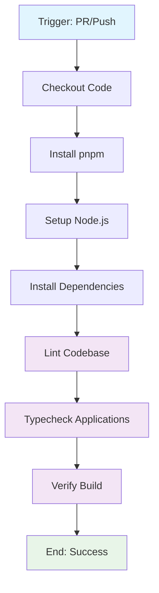

## Workflow Overview

**Purpose**: Validate the codebase through linting, type-checking, and building to ensure stability and quality before merging.
**Trigger Events**: 
- `pull_request` to `master` or `develop`.
- `push` to `master` or `develop`.
**Target Environments**: GitHub Actions (Runner: `ubuntu-latest`).

## Execution Flow Diagram



## Jobs & Dependencies

| Job Name | Purpose | Dependencies | Execution Context |
|----------|---------|--------------|-------------------|
| validate | Lint, Typecheck & Build | None | `ubuntu-latest` |

## Requirements Matrix

### Functional Requirements
| ID | Requirement | Priority | Acceptance Criteria |
|----|-------------|----------|-------------------|
| REQ-001 | Linting | High | `pnpm turbo lint` must pass without errors. |
| REQ-002 | Type-checking | High | `pnpm turbo typecheck` must pass for all apps. |
| REQ-003 | Build Verification | High | `pnpm turbo build` must successfully compile the project. |

### Security Requirements
| ID | Requirement | Implementation Constraint |
|----|-------------|---------------------------|
| SEC-001 | Dependency Integrity | Use `pnpm install --frozen-lockfile` to ensure repeatable builds. |

### Performance Requirements
| ID | Metric | Target | Measurement Method |
|----|-------|--------|-------------------|
| PERF-001 | Cache Efficiency | Use `pnpm` cache | GitHub Actions cache hit rate. |

## Input/Output Contracts

### Inputs

```yaml
# Repository Triggers
paths: [all]
branches: [master, develop]
```

### Outputs

```yaml
# Job Outputs
lint_status: boolean
typecheck_status: boolean
build_artifact: .next/** (Internal cache)
```

### Secrets & Variables

| Type | Name | Purpose | Scope |
|------|------|---------|-------|
| Variable | NODE_VERSION | Specify Node.js version (24.15.0) | Workflow |
| Variable | PNPM_VERSION | Specify pnpm version (10.4.1) | Workflow |

## Execution Constraints

### Runtime Constraints

- **Timeout**: Default GitHub Actions timeout.
- **Concurrency**: Not explicitly limited in this file.

### Environmental Constraints

- **Runner Requirements**: `ubuntu-latest`.
- **Node.js**: v24.15.0.
- **Package Manager**: pnpm v10.4.1.

## Error Handling Strategy

| Error Type | Response | Recovery Action |
|------------|----------|-----------------|
| Build Failure | Stop execution | Review logs, fix build errors locally. |
| Lint Failure | Stop execution | Run `pnpm lint:fix` locally. |
| Test Failure | Stop execution | Debug and fix failing tests. |

## Quality Gates

### Gate Definitions

| Gate | Criteria | Bypass Conditions |
|------|----------|-------------------|
| Code Quality | ESLint (Flat Config v9) | None allowed |
| Type Safety | TypeScript (Strict mode) | None allowed |
| Buildability | Success compile | None allowed |

## Monitoring & Observability

### Key Metrics

- **Success Rate**: 100% target for merge.
- **Execution Time**: Monitor duration of `turbo` tasks.

## Validation Criteria

### Workflow Validation

- **VLD-001**: Every PR must pass `validate` job before merging.
- **VLD-002**: Changes to `packages/shared` or `packages/ui` must trigger re-validation of dependent apps.

## Change Management

### Update Process

1. **Specification Update**: Modify this document first.
2. **Review & Approval**: Required by lead developers.
3. **Implementation**: Apply changes to `.github/workflows/ci.yml`.
4. **Testing**: Validate on a branch before merging.

### Version History

| Version | Date | Changes | Author |
|---------|------|---------|--------|
| 1.0 | 2026-04-21 | Initial specification after ESLint v9 migration. | Antigravity |
